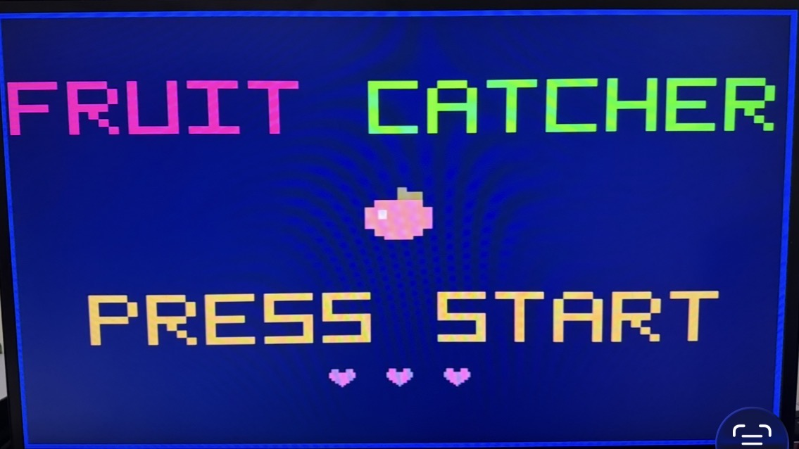

# RISC-Style CPU FPGA System

A custom **RISC-style CPU and FPGA-based game system** implemented in Verilog on the **Terasic DE10-Lite** development board. The project integrates a processor, memory system, VGA video output, and hardware controls to run an interactive **Fruit Catcher** game directly on the FPGA.

The system demonstrates how a custom processor can interact with memory-mapped hardware and real-time graphics to create a complete embedded system.

## Demo

### Fruit Catcher Gameplay




## Features

### Custom CPU
- RISC-style processor implemented in Verilog
- Program counter and instruction execution logic
- Register file for CPU data storage
- Instruction and data memory interfaces
- Memory read/write control
- FPGA integration through a top-level system module
- Executes a game program stored in FPGA memory

### VGA Graphics
- Real-time VGA video generation
- Hardware-generated game graphics
- Score display
- Three-heart life indicator
- Multiple falling fruit objects
- Player-controlled basket
- Custom on-screen game elements and borders

### Fruit Catcher Game
- Multiple fruit objects fall at different horizontal positions
- Basket can be moved using the DE10-Lite push buttons
- Fruit caught by the basket increases the score
- Missed fruit contributes toward losing a life
- Three consecutive misses remove one life
- Catching fruit resets the consecutive-miss counter
- Game tracks three lives using heart icons
- Score resets after all lives are lost
- Includes different movement speeds for player controls

## Technologies

- Verilog HDL
- Intel Quartus Prime
- FPGA digital design
- RISC-style processor architecture
- VGA video generation
- Memory-mapped I/O
- Embedded game development
- Terasic DE10-Lite FPGA board

## Hardware

The project was developed for the **Terasic DE10-Lite** development board.

Key hardware used:

- DE10-Lite FPGA development board
- 50 MHz onboard clock
- Push buttons for game controls
- VGA output
- VGA-compatible monitor
- VGA cable
- On-board LEDs for hardware/debug output

## System Architecture

The project combines a custom processor with FPGA peripherals to form a small system-on-chip style design.

```text
                +----------------------+
                |      CLOCK_50        |
                +----------+-----------+
                           |
                           v
                +----------------------+
                |   RISC-Style CPU     |
                |                      |
                |  Program Counter     |
                |  Register File       |
                |  Control / Datapath  |
                +----------+-----------+
                           |
                  Address / Data Bus
                           |
             +-------------+-------------+
             |                           |
             v                           v
    +------------------+       +----------------------+
    | Instruction /    |       | Memory-Mapped Game   |
    | Data Memory      |       | and VGA Hardware     |
    +------------------+       +----------+-----------+
                                          |
                              +-----------+-----------+
                              |                       |
                              v                       v
                         VGA Output             Push Buttons
                              |
                              v
                        Fruit Catcher
                            Display
```

## How It Works

1. The DE10-Lite's 50 MHz clock drives the FPGA design.
2. The custom CPU fetches and executes instructions stored in program memory.
3. The CPU communicates with the rest of the system through memory read/write signals.
4. Game state is updated using the processor and FPGA-side game logic.
5. The VGA subsystem continuously generates the video timing and pixel output required by the monitor.
6. Push-button inputs allow the player to move the basket.
7. The game logic tracks fruit positions, collisions, score, consecutive misses, and remaining lives.
8. Updated game state is rendered directly to the VGA display.

## Main Hardware Interfaces

The top-level FPGA design connects the CPU and game system to the DE10-Lite hardware.

```verilog
module soc_top (
    input        CLOCK_50,
    input  [1:0] KEY,
    output [3:0] VGA_R,
    output [3:0] VGA_G,
    output [3:0] VGA_B,
    output       VGA_HS,
    output       VGA_VS,
    output [9:0] LEDR
);
```

The push buttons on the board are active-low, while the VGA signals drive the external display.

## Project Structure

The Quartus project contains the processor, memory, VGA, game, and FPGA integration files.

```text
RISC-Style-CPU-FPGA-System/
└── cpuFPGA_Project(Only for Github)/
    ├── CPU / processor modules
    ├── program counter logic
    ├── register file
    ├── instruction and data memory
    ├── top-level FPGA integration
    ├── VGA timing / display logic
    ├── game rendering logic
    ├── game program / HEX memory contents
    └── Quartus project files
```

Important modules in the design include the top-level system module, program counter, register file, processor logic, VGA hardware, and game-related logic.

## Game Mechanics

The FPGA runs a simple arcade-style **Fruit Catcher** game.

### Objective

Move the basket across the bottom of the screen and catch the falling fruit.

### Scoring

Successfully catching fruit increases the player's score, which is displayed at the top of the screen.

### Lives

The player begins with three lives, represented by heart icons in the upper-right corner.

A life is lost after **three consecutive missed fruits**. Catching fruit before reaching three misses resets the consecutive-miss counter.

When all three lives are lost, the game resets the score.

### Controls

The DE10-Lite push buttons are used to control basket movement. The controls support movement in both directions with increased movement speed for responsive gameplay.

## VGA Output

The system generates VGA output directly from the FPGA.

The display subsystem is responsible for:

- Horizontal synchronization
- Vertical synchronization
- Pixel coordinate generation
- RGB color output
- Score rendering
- Life/heart rendering
- Fruit rendering
- Basket rendering
- Game border/background graphics

The monitor is connected directly to the DE10-Lite using VGA.

## Building the Project

### Requirements

- Intel Quartus Prime
- Terasic DE10-Lite board
- USB-Blaster connection
- VGA monitor and cable

### 1. Open the Project

Open the Quartus project contained inside:

```text
cpuFPGA_Project(Only for Github)/
```

### 2. Compile

In Quartus Prime, select:

```text
Processing -> Start Compilation
```

### 3. Connect the DE10-Lite

Connect the board to the computer through USB and connect the VGA output to a monitor.

### 4. Program the FPGA

Open:

```text
Tools -> Programmer
```

Select the generated programming file, enable **Program/Configure**, and program the DE10-Lite.

### 5. Play

Once programmed successfully, the VGA display will show the game and the DE10-Lite push buttons can be used to control the basket.

## What This Project Demonstrates

This project combines concepts from computer architecture and digital hardware design into a working FPGA system:

- Processor datapath and control
- Instruction execution
- Register-file design
- Program and data memory
- Hardware/software interaction
- Memory-mapped peripherals
- VGA timing and raster graphics
- Real-time user input
- FPGA synthesis and deployment
- Embedded game logic

Rather than testing the CPU only through simulation, the processor is integrated into a complete interactive hardware application.


## Author

**Kritagya Sharma**

GitHub: [@kre07](https://github.com/kre07)
